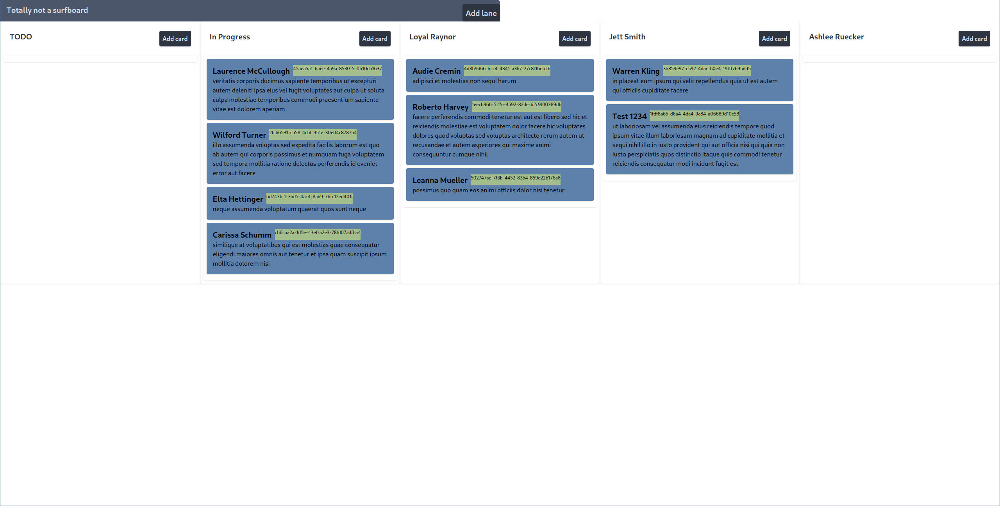

# Made with leptos (and love, never forget the love in anything you do! ;D)

<picture>
    <source srcset="https://raw.githubusercontent.com/leptos-rs/leptos/main/docs/logos/Leptos_logo_Solid_White.svg" media="(prefers-color-scheme: dark)">
    
</picture>

## Running

If you don't have `cargo-leptos` installed you can install it with

```bash
cargo install cargo-leptos
```

Then run

```bash
cargo leptos new --git leptos-rs/start-axum
```

to generate a new project template.

```bash
cd leptos-simple-kanban-board
```

to go to your newly created project.  
Feel free to explore the project structure, but the best place to start with your application code is in `src/app.rs`.  
Addtionally, Cargo.toml may need updating as new versions of the dependencies are released, especially if things are not working after a `cargo update`.

## Running your project

```bash
cargo leptos watch
```
